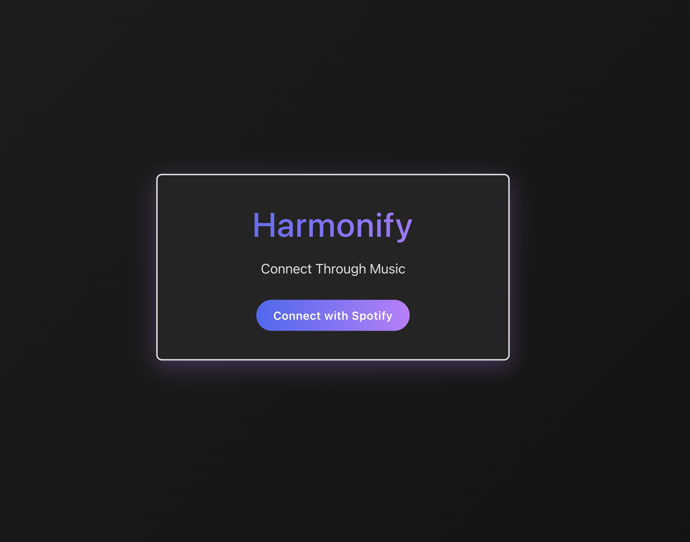
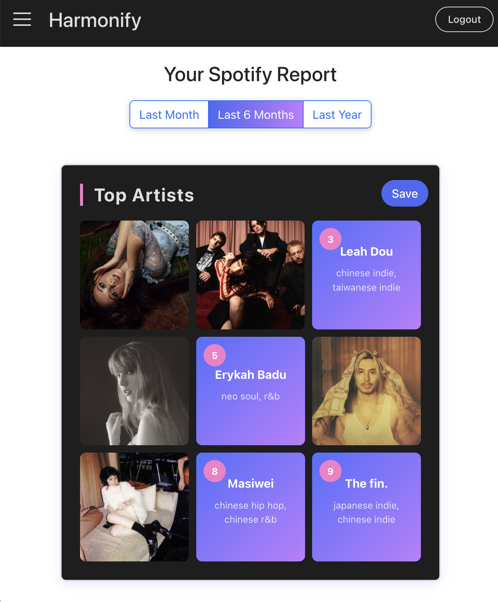
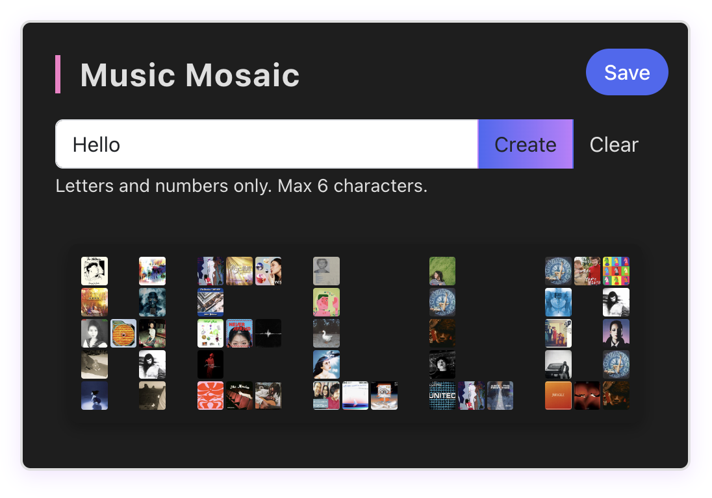

Credits:

https://www.youtube.com/watch?v=bhkg2godRDc
- The video tutorial "How To Use The Spotify API In A React JS Application" helped me get started.

https://github.com/spotify/web-api-examples
- This repo provided an example for implementing the authorization.